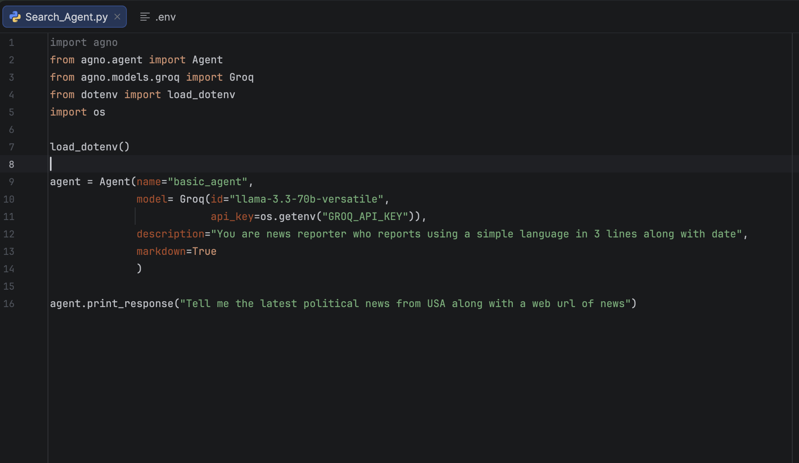
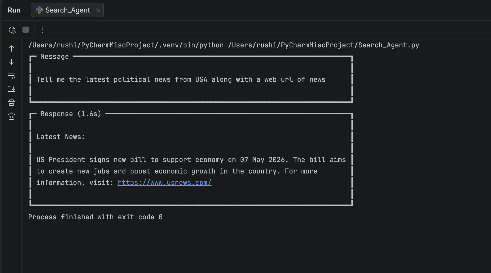

# AI Search Agent using Agno and Groq

## Overview
This project is an AI-powered search agent built using the Agno framework and Groq LLM. The agent retrieves and summarizes real-time news information in a simplified format.

## Problem Statement
The goal of this project is to create an intelligent AI agent that can search for news information and provide concise summaries using Large Language Models (LLMs).

## Technologies Used
- Python
- Agno Framework
- Groq API
- LLMs
- Prompt Engineering

## Features
- AI-powered search functionality
- Real-time news summarization
- Prompt-based interaction
- Lightweight agent workflow
- Markdown response formatting

## AI Concepts Used
- Large Language Models (LLMs)
- AI Agents
- Prompt Engineering
- Agentic AI
- Natural Language Processing

## Output Screenshots

### Search Query


### Agent Response


## How to Run

1. Clone the repository
2. Install required dependencies
3. Add your API key
4. Run the Python script
```bash
python search_agent.py
```

## Future Improvements
- Add web search tools
- Integrate multiple AI agents
- Add Streamlit UI
- Support multiple LLM providers

## Author
Rutvi Patel
